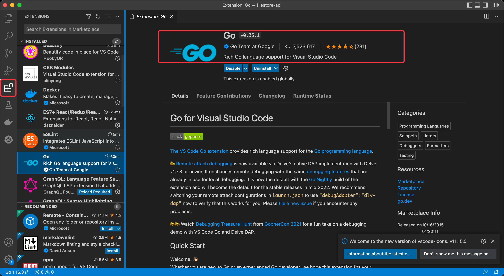
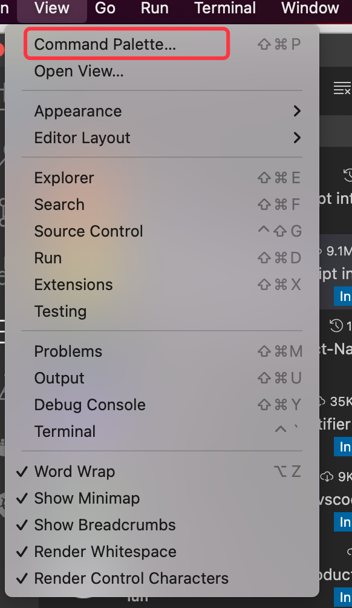
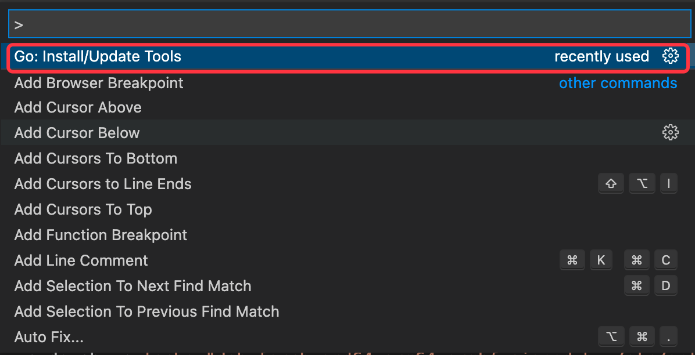
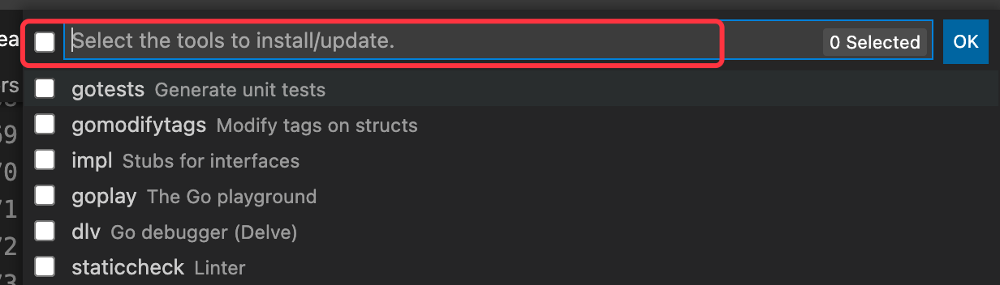

# 软件工程训练营案例

这是一个比较简单的网盘项目，分为三个阶段，每个阶段都是可以独立运行的程序。希望通过案例项目的学习，了解技术演变以及软件工程中除开编程以外的实践。三个阶段项目实现的功能一样，但是使用的技术不一样。架构更复杂，涉及到的知识也更多。

案例项目中，即使不会编写javascrip和golang的代码，通过整个项目工程，环境的搭建也可以体会到学习到很多软件开发的知识，对于构建自己的知识体系十分重要。作为程序员这些非编码的能力也是至关重要的。

项目功能：
1. 用户注册、登录、登出
2. 文件上传、下载、、删除和修改文件名

*建议学习路径：*
1. 不要关注编程语言的语法和代码逻辑，第一步将项目可以正确运行起来，文档中会有相关安装和设置相关软件的步骤。
2. 在使用项目的功能中*思考*这个功能，包含哪些知识点，这些对应知识点相关代码是哪些（不需要非常精确）
3. 然后阅读项目中代码，进行调试，对变量的变化进行追踪，了解代码的作用
4. 同样的逻辑，在网上搜索其他代码如何实现，工具如何使用，例如：github, stackoverflow

案例项目*目标*是渐进式的，依照自己的能力尽可能的学习每个阶段。
1. 能够将项目每个阶段的应用程序都运行起来，正常工作。
2. 理解Web开发在演变过程中架构的变化。
3. 能够理解关键技术和核心代码的作用，不需要逐行这样细致的理解。
4. 能够自己动手在以后的代码上实现功能。

## 开发指南

如果电脑是windows的，虽然项目的前后端都可以在windows上运行。但是为了省时高效，避坑，最好安装步骤*最好安装一份linux的虚拟机*，请安装ubuntu 22.04,步骤就不赘述。
https://blog.csdn.net/fx_yzjy101/article/details/123921383
https://www.bilibili.com/video/BV1Sa411N73A?vd_source=65d2ee48b37e8bf5b61ebe1928c1e8d7

### 安装docker
打开终端 terminal，执行以下命令安装docker
```bash
sudo apt-get update

sudo apt-get install \
    ca-certificates \
    curl \
    gnupg \
    lsb-release
sudo mkdir -p /etc/apt/keyrings

curl -fsSL https://download.docker.com/linux/ubuntu/gpg | sudo gpg --dearmor -o /etc/apt/keyrings/docker.gpg

sudo apt-get update
sudo apt-get install docker-ce docker-ce-cli containerd.io docker-compose-plugin
```
验证是否安装成功：
```bash
docker version
```
如果有需要，请给当前用户权限，执行下列命令后，执行docker命令，无需`sudo`
```shell
sudo usermod -a -G docker ${USER}
```

### 安装git
```bash
sudo apt-get update 
sudo apt-get install git
```

### 安装curl和wget等
```bash
sudo apt-get install wget curl binutils bison gcc make
```

### 阶段1
传统分层的“巨石”架构，没有前后端分离，html的内容是应用程序通过http请求发送给浏览器的。

1. 安装mysql(有了docker以后一切都变得简单轻松)
```bash
# 为了避免开发环境的不一致情况导致安装和运行时端口被占用，映射本地端口为33060
docker run --name mysql-summercamp -e MYSQL_ALLOW_EMPTY_PASSWORD=yes -p 33060:3306 mysql:8.0
```
2. 登录mysql容器创建数据库
```bash
# 这个命令使用bash登录容器
docker exec -it mysql-summercamp bash
# 在容器内使用mysql命令用root用户登录
mysql -u root
# 登录成功后，进入mysql的控制台
# 先执行查看数据库命令，了解当前环境下，mysql服务中有多少数据库
> show databases;
# 创建我们程序需要的数据库
> create database summercamp_filestore_dev;
# 指定当前使用的数据库
> use summercamp_filestore_dev;
# 将 phase1/doc/table.sql 全部内容复制到终端中执行（以下省略号表示复制内容，不是执行的内容）
> ......;
# 检查tables是否全部创建成功，显示如下内容即表示成功
#+------------------------------------+
#| Tables_in_summercamp_filestore_dev |
#+------------------------------------+
#| tbl_file                           |
#| tbl_user                           |
#| tbl_user_file                      |
#| tbl_user_token                     |
#+------------------------------------+
> show tables;
```
3. 安装redis
```bash
# 这里使用容器的方式启动redis，为了避免开发环境的不一致情况导致安装和运行时端口被占用，映射本地端口为63790
docker run --name redis-test -e ALLOW_EMPTY_PASSWORD=yes -p 63790:6379 bitnami/redis:6.0.4
```

4. 安装后端golang
这里标准安装是在ubuntu下，如果动手能力强的同学喜欢在windows下进行，请选中golang的msi文件进行安装
```bash
# 安装gvm 版本管理器
bash < <(curl -s -S -L https://raw.githubusercontent.com/moovweb/gvm/master/binscripts/gvm-installer)
source /root/.gvm/scripts/gvm
# 安装golang 1.16.13
gvm listall
gvm install go1.16.13 -B
gvm use go1.16.13
# 成功安装后，使用如下命令，检查版本是否正确
go version
# 设置go语言环境
go env -w GOPROXY=https://goproxy.cn,direct
go env -w GO111MODULE=on
```

5. 运行项目
```
cd phase1
go run main.go
```

6. 在浏览器中敲入 
http://localhost:8080/static/view/signup.html 注册
http://localhost:8080/static/view/signin.html 登录

### 阶段2
采用了前后端分离

1. 安装node和npm环境
```bash
curl -o- https://raw.githubusercontent.com/nvm-sh/nvm/v0.39.1/install.sh | bash
nvm install 16.13
# 成功安装后，使用如下命令，检查版本是否正确
node --version
```

2. 运行api项目（后端程序）
```base
cd phase2/filestore-api
go run main.go
```

3. 安装和运行前端项目
```bash
cd phase2/filestore-web
npm install
npm run dev
```

4. 在浏览器中敲入
http://localhost:3000/register 注册
http://localhost:3000/login 登录


### 阶段3
```bash
docker-compose up --build
```

### 配置安装编辑器

建议使用vscode，前后端均可兼顾。
1. 安装vscode，使用如下步骤（推荐使用）
```bash
wget -qO- https://packages.microsoft.com/keys/microsoft.asc | gpg --dearmor > packages.microsoft.gpg
sudo install -D -o root -g root -m 644 packages.microsoft.gpg /etc/apt/keyrings/packages.microsoft.gpg
sudo sh -c 'echo "deb [arch=amd64,arm64,armhf signed-by=/etc/apt/keyrings/packages.microsoft.gpg] https://packages.microsoft.com/repos/code stable main" > /etc/apt/sources.list.d/vscode.list'
rm -f packages.microsoft.gpg
sudo apt install apt-transport-https
sudo apt update
sudo apt install code
```
因为ubuntu 22.04都安装了snap，所以也可以使用命令
```bash
sudo snap install --classic code
```
如果snap无法安装，请使用上面较为繁琐的步骤。

2. 安装plugin和配置编辑器
- 安装配置go语言插件


- 配置插件
根据菜单顺序 View --> CommandPaletter --> Go: Install/Update Tools command.



选中安装所有packages


3. 安装配置前端插件
ESLint, npm intellisense, Prettier, Vetur, JavaScript (ES6) code snippets
